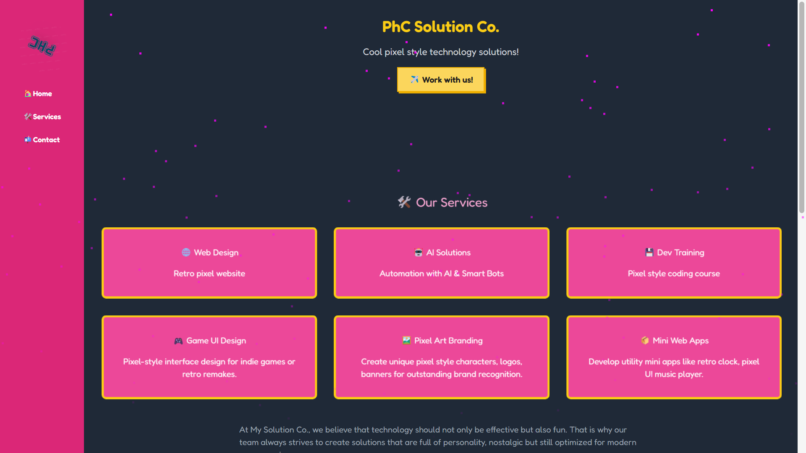

# 🎮 My Solution Co. - Pixel Art Solution Website

A playful retro-themed solution company website featuring pixel-art UI, TailwindCSS styling, and quirky animations.

## 🌟 Features

- 🎨 Pixel-style UI with retro fonts and color schemes
- ⚙️ TailwindCSS-based responsive layout
- ✨ Animated effects: glowing logos, pixel fireworks, retro popups
- 🌙 Light/Dark theme support
- 🖼️ Partner logos with hover glow and styled frames
- 🤖 Sections for services, contact, and more

## 🏗️ Project Structure

```
my-solution-co/
│
├── index.html
├── assets/
│   ├── css/
│   │   ├── style.css
│   │   └── animations.css
│   ├── js/
│   │   └── script.js
│   └── images/
│       ├── logo.png
│       ├── bg-forest.png
│       ├── partner1.png
│       ├── partner2.png
│       └── partner3.png
├── components/
│   ├── header.html
│   ├── services.html
│   ├── contact.html
│   └── footer.html
└── README.md
```

## 🚀 How to Run

Just open `index.html` in your browser. No build tools required!

## 📸 Preview

 <!-- Replace with actual screenshot path -->

## 📬 Contact

Built with 💖 by [My Solution Co.]  
For collaborations or inquiries, drop us a pixel-message!
